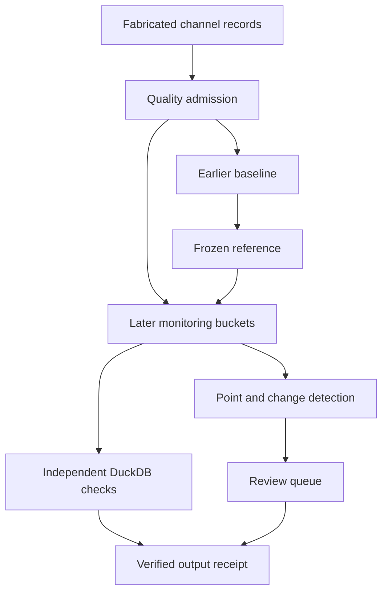

# Complaint Paradox — Public Engineering Companion

**Public-safe research engineering portfolio by Mahfuzur Rahman**

[](https://github.com/mahfuzurrahman-research/complaint-paradox-engineering/actions/workflows/public-validation.yml)

This repository demonstrates the software and data-engineering practices used around a private research project on administrative observability and complaint-based performance measurement. It is intentionally separated from the private scientific repository.

The purpose is to make engineering capability independently inspectable **without publishing the manuscript, real analytical datasets, exact empirical specification, private results, bootstrap outputs, or restricted provenance**.

## What this public companion demonstrates

- Python-based input monitoring and automated reporting
- SQL / DuckDB analytical modeling
- synthetic-data pipeline design
- schema, uniqueness, missingness and range checks
- complaint-signal admission using completeness, availability and exposure contracts
- channel-specific exposure normalization and frozen historical references
- point-anomaly alerts and a bounded, stateful CUSUM change detector
- label-free review queues and offline synthetic injection evaluation
- deterministic machine-readable outputs
- unit and failure-mode tests
- GitHub Actions continuous integration
- bounded Docker execution
- public-safe static dashboard generation
- explicit separation between engineering verification and scientific claims

## Complaint-signal upgrade

The signal pipeline separates measurement problems from changes in admitted
complaint rates. Every scheduled area/day requires both reporting channels,
complete batches, positive declared exposure and records available at the
monitoring deadline. Missing, late, duplicate and incomplete buckets are blocked;
a genuine observed zero is admitted. Blocked buckets reset change-detector state.

Historical channel rates are fitted on an earlier, complete baseline and then
frozen. Expected counts adjust for each channel's fabricated reporting exposure.
Large standardized deviations generate point alerts; a clipped, streak-gated
two-sided CUSUM generates an alert for a sustained shift. Review records carry
policy/reference IDs and reasons. They authorize no adverse action.

The injection labels live in a separate file used only for offline evaluation.
The default seed demonstrates an isolated spike, a sustained rate shift, access
growth, missing channels, delayed batches, zero exposure and a valid zero.
See [method and limitations](docs/signal_detection.md),
[observed validation](docs/signal_validation_record.md) and
[supported CV wording](docs/cv_evidence.md).
The [repair record](docs/repair_record.md) explains the cancelled CI job and the
validation gaps corrected on 2026-10-06.

## Public architecture

The original synthetic panel produces monitoring, DuckDB marts, reports and a
static dashboard. The signal stream follows a separate admission/reference path:



## Repository map

| Path | Purpose |
|---|---|
| `data/synthetic/`, `src/` | Original synthetic panel, monitoring and reporting |
| `signal_demo/`, `contracts/` | Signal admission, frozen policy and detectors |
| `sql/` | DuckDB schema, marts and independent checks |
| `tests/`, `tests_signal/` | Original and signal validation suites |
| `dashboards/`, `examples/` | Static dashboard and synthetic analytical example |
| `docs/` | Method, claim boundaries, validation and CV evidence |
| `.github/workflows/`, `Dockerfile` | Hosted validation and container configuration |
| `run_all_demos.sh` | Combined pipeline and test entry point |

## Quick start

Tested environment: Python 3.12 on Linux. Signal output locking uses POSIX
`fcntl`; use the Docker image on Windows. Direct dependency versions are pinned.

```bash
python -m venv .venv
source .venv/bin/activate
python -m pip install -r requirements.txt
bash run_all_demos.sh
```

The run creates only public-safe outputs under `outputs/`.

Run only the new signal pipeline with `bash run_signal_demo.sh`, or verify an
existing signal run with `python -m signal_demo.pipeline --verify-only`.
The original panel remains available with `bash run_public_demo.sh`.

Signal CSV/JSON outputs, a DuckDB database and the replay/integrity receipt are
written under `outputs/signals/`. Fully verified staging replaces the completed
directory; ordinary publication exceptions restore the previous run. Verification
checks hashes, current sources/dependencies/policy and semantic replay from raw
inputs, including all database relations. Rewriting hashes alone cannot hide
altered scores, alerts or reports. Receipts are explicitly unsigned and establish
no producer authenticity. Database file bytes may vary across equivalent builds.
See the reproducibility document for publication and process-lock limits.

## Engineering boundary

This repository is **not** the scientific replication package for the private Complaint Paradox paper. It intentionally contains no pathway for reconstructing the private empirical study.

It does not contain:

- manuscript text;
- canonical analytical datasets;
- real research rows or disguised subsets;
- exact private variable construction;
- exact unpublished model specification;
- empirical coefficients, p-values or bootstrap results;
- private execution logs or seed manifests;
- restricted provenance or journal-review material.

The synthetic data were generated specifically for this companion and are not derived row-by-row from the private research data.

## Capability matrix

See [`docs/capability_matrix.md`](docs/capability_matrix.md).

## Reproducibility

See [`docs/reproducibility.md`](docs/reproducibility.md).

## Copyright and reuse

Copyright © 2026 Mahfuzur Rahman. All rights reserved.

No open-source license is granted by this repository. See [`COPYRIGHT.md`](COPYRIGHT.md).
